# Geography Quiz
#### Geography Quiz is a game for all family or kids who wants to learn about geography. This quiz has 12 general geography questions and correct and wrong answers and scores.  
#### This site will be targeted towards adults and children alike a simple app to learn geography. 

# Features
* Header
  - Featured in the middle of the page, the header shows the quiz name: Geography Quiz.
  - This header clearly tells the user what quiz they are playing.

  

* The Quiz options
  - The Quiz options include a clear instruction how to navigate the quiz.

  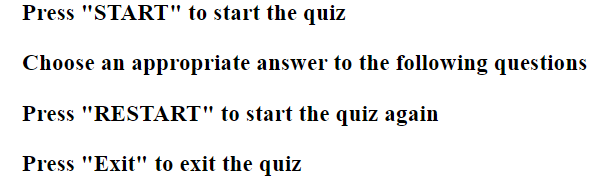

* The Start button

  - This section provides interactive button that the user can click to start the quiz.

  

* The Quiz questions
  - This section provides the question and four options of answer and at the bottom, correct and incorrect answers score. This section will allow the user to see exactly how many correct and incorrect answers they have provided. 

  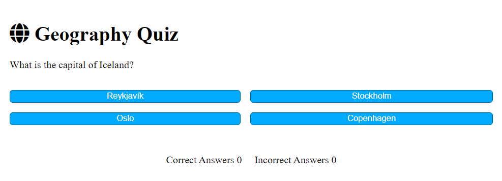 

  - When the user clicks an option with the correct answer, the color of the page and the correct answer turns green and the score of correct answers is changing. 

  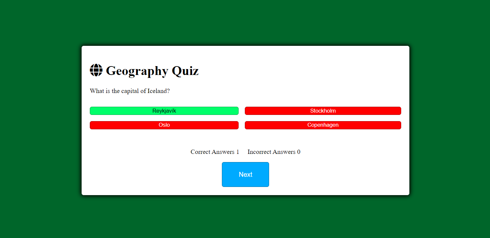

  - When the user clicks an option with the incorrect answer, the color of the page and the incorrect answer turns red and the score of incorrect answers is changing.

  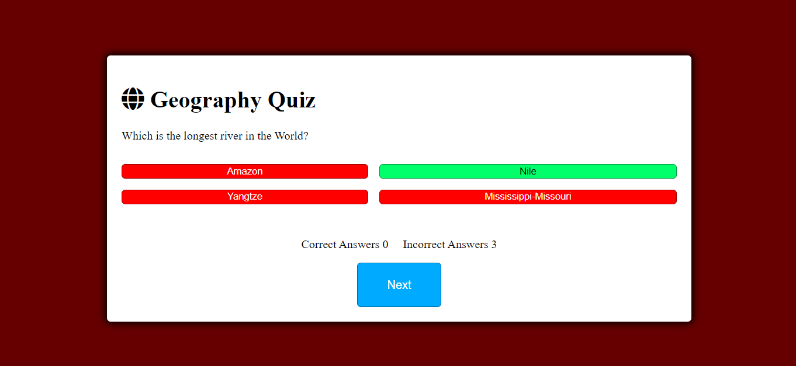

  - When the user will have the last 12th question at the bottom of the page will be the final score of the quiz of correct and incorrect answers also will appear with two buttons: "RESTART" and "EXIT".

  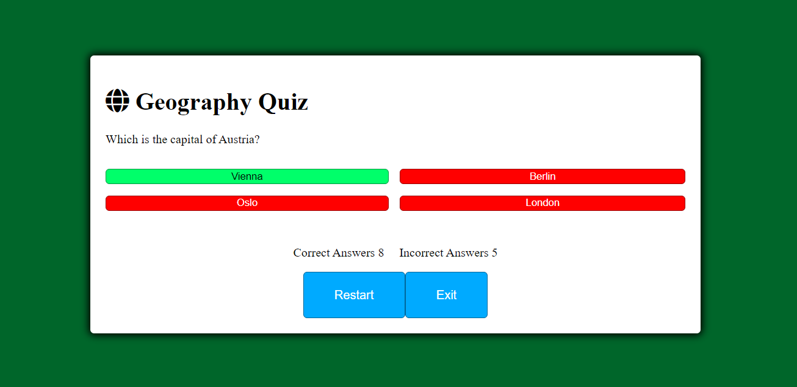

  - When the user clicks on the "RESTART" button the quiz will restart from the beginning with an updated score of correct and incorrect answers with the new questions as questions will be shuffled.

  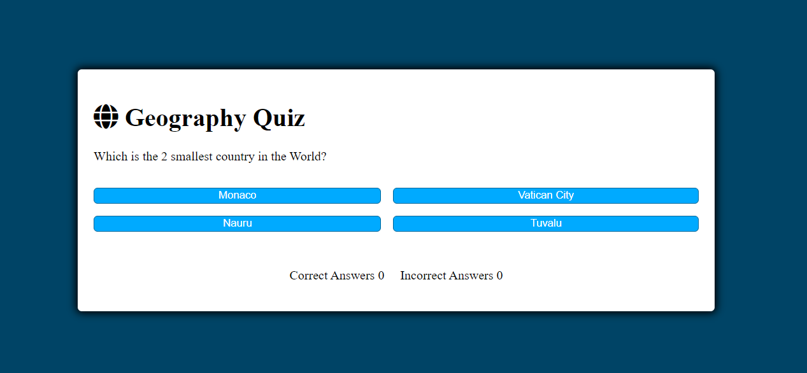

  - When the user clicks on the "EXIT" button the quiz will be over and will bring to the instruction page with the "START" button at the bottom of the page. 

  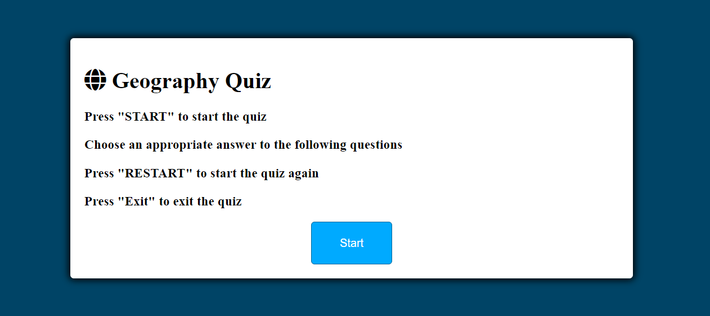

# Testing 
* I tested quiz in different browsers: Chrome, Safari.
* I confirmed that the quiz results are always correct.
* I confirmed that the header, instruction, options are all readable and easy to understand. 
* I confirmed that the colors and fonts choosen are easy to read and accessible by running it through lighthouse in devtools

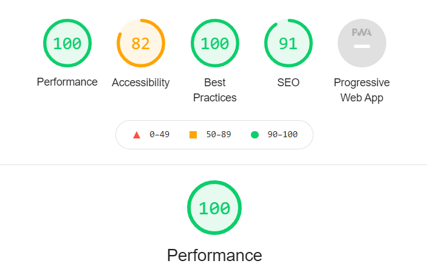

* I confirmed that this project is responsive, looks good and functions on all stadart screen sizes using the devtools device toolbar. 

# Bugs
* When I deployed my project to GitHub Pages I discovered an error:
* link rel="shortcut icon" type="image/jpg" href="Favicon_Image_Location"
* I changed in my html to:
* link rel="shortcut icon" type="image/jpg" href="assets/images/"/
* Fixed the problem. 

# Validation testing
* HTML
 - No errors were found when passing through the official (W3C HTML Validator)
 -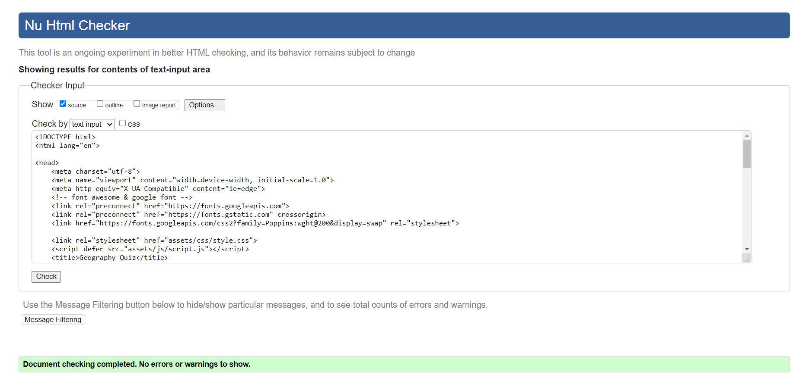

* CSS
 - No errors were found when passing through the official (W3C CSS Validator (Jigsaw))
 -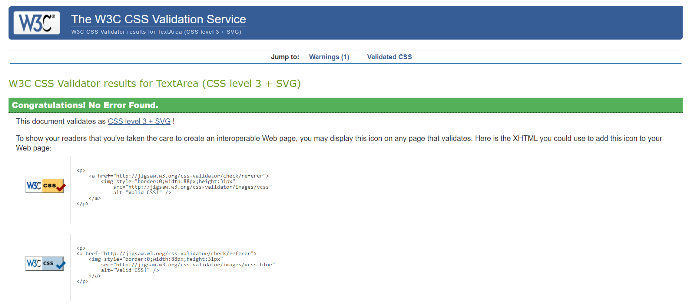

* JavaScript
 -No errors were found when passing through the official (JSHint JavaScript Validator)

 -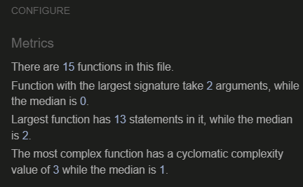

# Unfixed bugs
* No unfixed bugs

 # Deployment
 * The site was deployed to GitHub pages. The steps to deploy are as follows:
  - In the GitHub repository, navigate to the Settings tab.
  - From the source section drop-down menu, select the Main Branch. 
  - Once the Main Branch has been selected, the page provided the link to the completed website. 
* The live link can be found here ../https://dublinswords.github.io/Geography-Quiz/.

# Credits
* Web Dev Simlified some code was adopted, coments in my code show exactly what code was adopted ../https://www.youtube.com/watch?v=riDzcEQbX6k&list=RDCMUCFbNIlppjAuEX4znoulh0Cw&start_radio=1&rv=riDzcEQbX6k&t=0 
* Love Maths project some code was adopted as well from this project.
* Ultimate Rock, Paper, Scissors as example for README.md.  